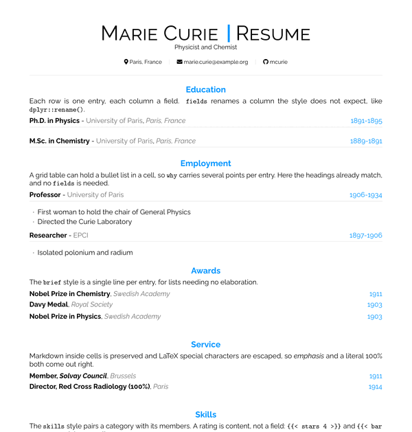
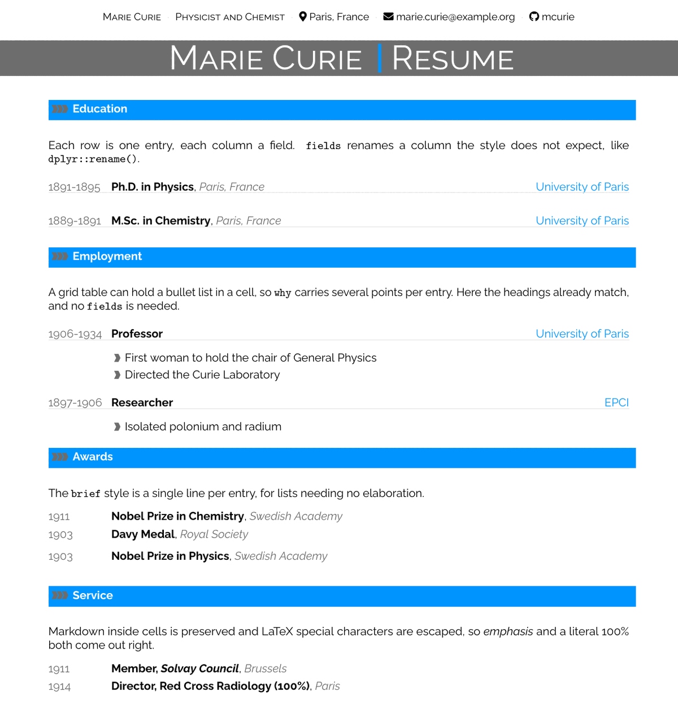
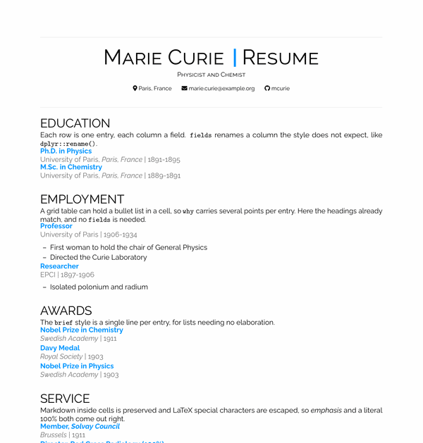
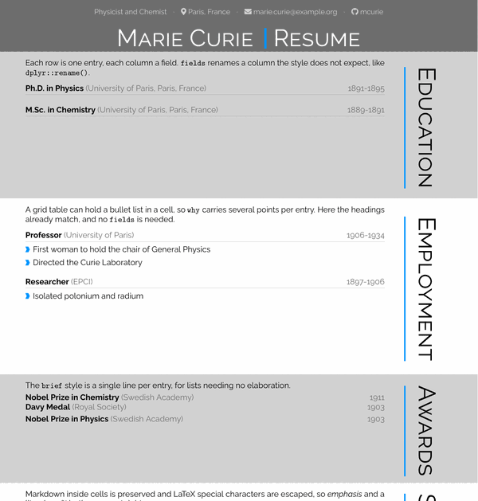
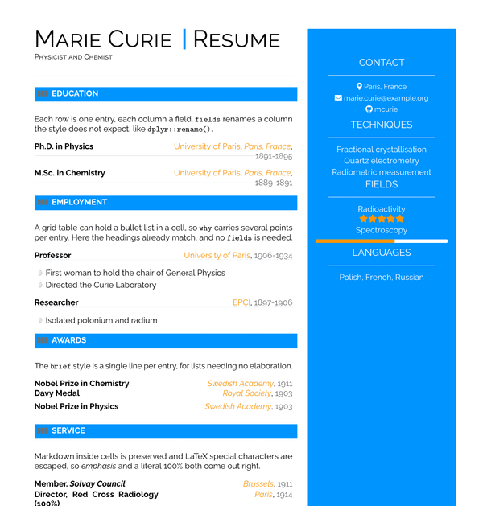
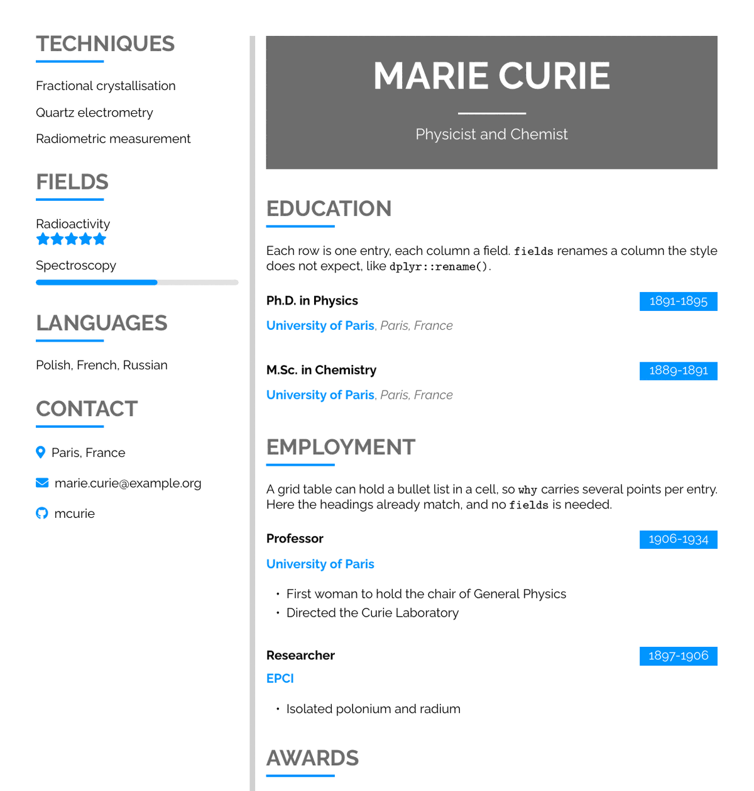
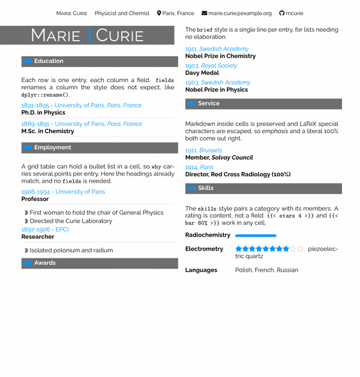

# latexcv

Quarto formats for the seven text CV designs in
[jankapunkt/latexcv](https://github.com/jankapunkt/latexcv), from a plain
centred résumé to filled section bars, alternating bands, and a tinted sidebar.
Every design takes the same document, so switching between them is a one-line
change. CV entries are written as tables, either by hand or generated by code.

## Installing

```bash
quarto use template quarto-vitae/latexcv
```

This installs all seven designs and creates a starting `template.qmd`. To add
them to a document you already have, use `quarto add quarto-vitae/latexcv`.

Rendering needs a LaTeX installation with **pdflatex**. If you have no LaTeX,
`quarto install tinytex` will do; the packages are fetched on the first render.

## Designs

Upstream ships each design as its own standalone document rather than as an
option on a shared class, and that is how they are packaged here: seven
independent extensions. Change the `format:` line to change the design; nothing
else in the document needs to move, and the output keeps its name.

What the designs have in common (the preamble, the listings, the filters and
the `stars` and `bar` shortcodes) is installed with them as an eighth
extension, `latexcv-common`, which each design draws from. It is not a format
and is never named in a `format:` line.

<table>
<tr>
<td width="160"></td>
<td><code>format: latexcv-classic-pdf</code><br>A centred title, centred headings, and full-width entries under a hairline. The plainest of the set.</td>
</tr>
<tr>
<td></td>
<td><code>format: latexcv-modern-pdf</code><br>Contacts in a running head over a full-bleed dark title bar, a filled accent bar per section, and the date in its own left-hand column.</td>
</tr>
<tr>
<td></td>
<td><code>format: latexcv-minimalistic-pdf</code><br>No bars and no rules. Large uppercase headings, entries separated by space alone.</td>
</tr>
<tr>
<td></td>
<td><code>format: latexcv-rows-pdf</code><br>The page as a stack of full-width bands, one per section, shaded alternately, each named by a large heading turned on its side down its right margin.</td>
</tr>
<tr>
<td></td>
<td><code>format: latexcv-sidebar-pdf</code><br>A tinted column of contacts and skills down the right, beside the main content.</td>
</tr>
<tr>
<td></td>
<td><code>format: latexcv-sidebarleft-pdf</code><br>Two columns on white divided by a thick rule, a filled title panel over the wide one, dates on filled badges, and skills drawn as rating bars.</td>
</tr>
<tr>
<td></td>
<td><code>format: latexcv-twocolumn-pdf</code><br>The body in two balanced columns, the name a filled bar opening the left one, contacts in a running head and a filled bar across the foot.</td>
</tr>
</table>

### The sidebar column

The two sidebar designs fill their column from a `sidebar:` list in the front
matter. Your contact details are added at the top of it automatically; every
other design ignores the setting, so it can stay in the document as you switch
between them.

```yaml
sidebar:
  - title: Techniques
    items:
      - Radiochemistry, electrometry
      - Fractional crystallisation
  - title: Activities
    items: [Solvay Conference, Radium Institute]
```

### The band above the first section

Anything written before the first heading becomes a band of its own in `rows`,
and if `profilepic` is set it is laid out beside the photograph, which is how
upstream heads its page, with a photo and a block of status lines next to it.

````markdown
---
profilepic: "marie.png"
format: latexcv-rows-pdf
---

::: {.entries style="skills"}
| what   | with                                           |
|--------|------------------------------------------------|
| Status | Physicist and chemist, two-time Nobel laureate |
| Fields | Radioactivity, atomic physics                  |
:::

# Education
````

With a photo and nothing written beside it, the photo gets the band to itself;
with neither, there is no band. The other designs set that same content as
ordinary paragraphs ahead of their first section.

### Star ratings

`` sets four filled stars out of five. Any other total is
written as a fraction: `` is the ten-star rating upstream's
`sidebar` gives its fields.

A rating is content rather than a field, so it is written wherever the thing it
rates is written: in any cell of any listing, in a sidebar item, or in a
sentence.

```markdown
::: {.entries style="skills"}
| what           | with                                     |
|----------------|------------------------------------------|
| Radiochemistry |                       |
| Electrometry   |  piezoelectric quartz  |
:::
```

```yaml
sidebar:
  - title: Fields
    items:
      - "Radioactivity "
```

The filled stars take the accent colour and the empty ones are drawn as
outlines. A sidebar column overrides both (the complementary accent against
white, as upstream sets them) and puts the rating on the line below whatever
it rates, since ten stars are most of that column's width. Write the label and
the rating as one item and the break is added for you.

Deliberately not a column on an entry: a column would have to mean the same
thing in all seven designs, and a document could then rate only the one thing
that column was for.

### Bar ratings

`` draws the same rating as a filled bar, the way upstream's
`sidebarleft` rates a skill. It goes wherever `stars` goes, and the two are
interchangeable: every design defines both, so a document keeps its ratings as
it switches between them.

The proportion may be written any of four ways, all meaning four fifths:

| Written | Read as |
|---------|---------|
| `` | a percentage |
| `` | a fraction of one |
| `` | a ratio |
| `` | a bare number above 1 is a percentage |

A bar is drawn at two fifths of whatever measure it lands in, so one written in
a sentence or a table cell sits on the line beside its text. A sidebar column
overrides that as it does for stars: full column width, on the line below the
label, and recoloured so the filled half does not disappear into the tint.

## Using

Set the format and describe yourself in the YAML header:

```yaml
---
name: Marie
surname: Curie
position: Physicist and Chemist
email: "marie.curie@sorbonne.fr"
www: mariecurie.fr
orcid: 0000-0002-1825-0097
format: latexcv-classic-pdf
---
```

Write each section as a heading, and each listing as a table inside an
`.entries` div. One row becomes one entry, and one column becomes one field on
it, named by its heading:

```markdown
# Experience

::: {.entries style="brief"}
| when       | what                 | with                |
|------------|----------------------|---------------------|
| 1906--1934 | Professor of Physics | University of Paris |
:::
```

Where your data uses different headings, rename them with `fields`, written
`new: old` in the manner of `dplyr::rename()`:

```markdown
::: {.entries style="brief" fields="{what: Position, with: Institution, when: Years}"}
```

Markdown inside table cells is preserved, so `**bold**`, `*italic*` and links
all work. LaTeX special characters are escaped for you exactly once, so a
literal `100%` needs no backslash.

### Entries from code

More often the data lives in a data frame, and the same options are given as
cell options. The cell prints a table and the filter picks it up:

````markdown
```{r}
#| vitae:
#|   style: detailed
#|   fields:
#|     when: Years
#|     what: Position
employment |> arrange(desc(Years))
```
````

`echo: false` is set by the formats, so the code that builds a listing stays out
of the CV.

Entries can also come from a CSV printed by a cell, from several tables in one
div, or carry bullet lists written in grid table cells. Those are covered in
the [vitae documentation](https://quarto-vitae.github.io/).

## Styles

These formats implement the three conventional vitae listing styles.

`detailed`
: An entry headline built from `what`, `with`, `where` and `when`, followed by
  a bulleted elaboration from `why`. Suits employment and projects. This is the
  style used when none is given.

`brief`
: A single line per entry, from the same four fields without `why`. Suits
  education, awards and memberships. `what` is set in bold, so use `*emphasis*`
  rather than `**bold**` to pick out part of it.

`skills`
: A category in `what` paired with its members, given either as one string in
  `with` or as a list in `why`. `sidebarleft` also reads `level`, as above.
  This is upstream's `\metasection`, which every design there sets in some
  form. The category column is measured from the widest category in the
  listing, so the members align down it whatever the categories are called.
  `sidebar` sets the members on the line *below* the category instead, as
  upstream's own does with its rated fields, since its listings are set in a
  column a third of the page wide, where a rating beside a category would
  crowd or wrap it.

Because each design ships its own listings, a style is free to mean something
different in each: that is what lets `sidebarleft` draw bars where the others
set text. The three names and their four core fields are common to all seven,
so a document stays portable.

## Format options

Set these in the YAML header. All are optional except `name`.

### Header contents

| Option | Effect |
|--------|--------|
| `name`, `surname` | The name shown in the title |
| `position` | A role or subtitle under the name |
| `docname` | Set beside the name, defaulting to `Resume`. Ignored by `twocolumn`, which follows upstream in setting the accent rule between the given and family names instead |
| `address`, `phone`, `email`, `www` | Contact details |
| `github`, `gitlab`, `linkedin`, `twitter` | Code and social profiles |
| `mastodon` | Given as `{instance: fosstodon.org, name: user}` |
| `scholar`, `orcid`, `stackoverflow` | Research and Q&A profiles |
| `dateofbirth` | Shown with a cake icon, as upstream does |
| `extrainfo` | A list of `{icon: ..., text: ...}` pairs, for anything not listed above. `icon` is a [Font Awesome 5](https://fontawesome.com/v5/search) name. |
| `sidebar` | Sections for the sidebar designs, as above |
| `profilepic` | A photograph. Every design places it: centred above the title in `classic` and `minimalistic`, top-right in `modern` and `twocolumn`, at the head of the column in the sidebar designs, and in a band of its own above the first section in `rows`. `profilepic-width` overrides the size |
| `qrcode` | An image set at the foot of the sidebar column |
| `footer` | A trailing line, set in the accent colour. `twocolumn` sets it instead in a filled bar across the foot of every page, falling back to `www` and `github` when it is not given, as upstream does |

### Appearance

| Option | Effect |
|--------|--------|
| `sectcol` | Accent colour as a hex string, such as `"0096FF"`. `headcolor` is accepted as an alias, so the same header drives the other vitae templates. |
| `bgcol` | Dark neutral, for title bars and the secondary half of a headline |
| `softcol` | Light neutral, for the hairlines between entries |
| `complcol` | Complementary accent, used by the sidebar designs |
| `lightcol` | Page tint, used by `rows` for its shaded bands |
| `fontfamily` | A LaTeX font package, defaulting to `raleway`. Upstream's alternatives (`roboto`, `cmbright`, `comfortaa`, `iwona`, `gillius`) all work, with options in `fontfamilyoptions`. |
| `fontsize` | Base font size, defaulting to `10pt` |
| `papersize` | Paper size, defaulting to `a4` |
| `geometry` | Page margins, passed to the `geometry` package |
| `linestretch` | Line spacing |
| `pagenumbers` | Set `true` to number the pages, which upstream does not |
| `column-widths` | How far a column measurement reaches: `document` (the default) or `listing`. See below |
| `columnsep` | Gutter between the columns of `twocolumn` and the sidebar designs |
| `main-ratio`, `sidebar-ratio` | The share of the page taken by the main column (`sidebar`) or the narrow one (`sidebarleft`) |

## Licensing

Released under the MIT licence, see [LICENSE](LICENSE.md). Built on
[latexcv](https://github.com/jankapunkt/latexcv) by Jan Küster.

---

> [!TIP]
> **This is one of several vitae templates for Quarto.**
>
> They share the same entry syntax, so a CV written here can be rendered with a
> different design by changing the `format:` line. To browse the other
> templates, read the full guide to writing a CV, or build a template of your
> own, visit <https://quarto-vitae.github.io/>.
